# Architecture — Adaptive Multi-Agent Financial Research Analyst



## Overview

This system uses a 5-agent LangGraph pipeline to turn a stock ticker into a
grounded, judged financial research report. Each agent has one job, reads
from a shared `GraphState`, and writes its output back into that state for
the next agent to use.

```
Data Agent → Retriever Agent → Analyst Agent → Judge Agent → Report Agent
                   ↑        |
                   |________|
              (confidence check loop:
               re-retrieve if retrieval is
               insufficient, max 2 retries)
```

---

## Shared State

All agents read/write a single `GraphState` object as they run:

```python
class GraphState(TypedDict):
    ticker: str
    price_data: dict
    fundamentals: dict
    filing_text: str
    retrieved_chunks: list
    report_draft: dict
    judge_score: dict
    final_report: str
```

---

## Agent Contracts

### 1. Data Agent
- **Input:** `ticker: str`
- **Output:** `price_data: dict`, `fundamentals: dict`, `filing_text: str`
- **Job:** Fetch raw price/fundamentals data (yfinance) and the latest 10-K
  filing text (SEC EDGAR). No interpretation — just clean, structured raw
  material for downstream agents.

### 2. Retriever Agent
- **Input:** `filing_text: str`, a user question (or a default research
  question like "what are the key risks and opportunities?")
- **Output:** `retrieved_chunks: list[dict]` (chunk text + section label +
  relevance info)
- **Job:** Chunk and search the filing text for the passages relevant to the
  question. Includes an adaptive step: scores its own retrieval confidence
  and re-queries (reformulated) up to 2 times if the first pass is
  insufficient.

### 3. Analyst Agent
- **Input:** `retrieved_chunks: list`, `price_data: dict`, `fundamentals: dict`
- **Output:** `report_draft: dict` (`bull_points`, `bear_points`, `summary`,
  `citations`)
- **Job:** Synthesize the retrieved filing text and market data into a
  structured, cited bull case / bear case / neutral summary. Explicitly does
  **not** give buy/sell recommendations.

### 4. Judge Agent
- **Input:** `report_draft: dict`, `retrieved_chunks: list` (needed to verify
  grounding)
- **Output:** `judge_score: dict` (`grounding`, `completeness`, `clarity`,
  `overall`, `flagged_issues: list[str]`)
- **Job:** Score the Analyst's draft against a fixed rubric. Two
  interchangeable modes: a baseline large API model, and (later) a
  LoRA fine-tuned small model distilled to imitate it.

### 5. Report Agent
- **Input:** `price_data`, `report_draft`, `judge_score`, `retrieved_chunks`
  (as sources)
- **Output:** `final_report: str` (formatted markdown)
- **Job:** Assemble everything into one clean, user-facing report — no new
  analysis, just formatting and packaging.

---

## Why the Feedback Loop Exists

The Retriever Agent isn't purely linear. After retrieving chunks, a
confidence-scoring step (CRAG-style) checks whether the retrieved text is
actually sufficient to answer the question. If not, it reformulates the
query and retries — up to a max of 2 retries — before handing off to the
Analyst. This is the "adaptive" part of the project and one of its two core
research contributions.

## Why the Judge is Swappable

The Judge Agent is designed from day one to run in two modes
(`judge_mode = "api"` or `"finetuned"`) so that later in the project, a
LoRA-distilled small model's judgments can be directly compared against the
large API model's judgments on the same reports — this is the second core
research contribution.
